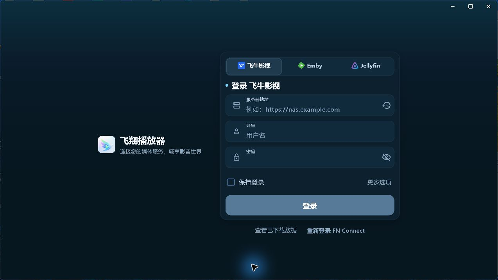

# Fly Player · 飞翔播放器

基于 Flutter 与 mpv 开发的媒体播放器，连接 **飞牛影视、Emby 和 Jellyfin**，在 Android 与 Windows 上浏览媒体库、查看影视详情并播放视频。

项目围绕个人媒体库使用场景，提供海报浏览、动态主题、字幕与弹幕、剧集续播，以及面向触屏和桌面的独立播放界面。

## 界面预览

以下图片截自 Windows 程序的实际运行界面。

### 服务连接

在同一入口选择飞牛影视、Emby 或 Jellyfin；已有下载内容可从登录页进入。



## 平台支持

| 平台 | 当前分支状态 | 播放实现 |
| --- | --- | --- |
| Android | 已接入，构建目标为 `arm64-v8a` | `NativePlayerActivity` + `mpv-android` |
| Windows | 已接入媒体浏览与桌面播放 | `media_kit` + libmpv；可选 PotPlayer 外部播放 |
| Linux / macOS | 当前分支尚未开放播放入口 | 仍需平台适配 |
| iOS / Web | 暂未接入完整播放链路 | — |

不同服务端提供的清晰度、章节、下载等能力存在差异，应用按后端能力显示相应入口。

## 主要功能

### 媒体浏览与界面

- 连接飞牛影视、Emby、Jellyfin，浏览媒体库、搜索、筛选和收藏。
- 影视、季、剧集与演职员详情，继续观看和剧集选择。
- 海报浏览模式、根据封面取色的动态主题、深浅色与多语言界面。
- Windows 侧栏导航、浏览与详情分屏、鼠标悬停反馈和键盘快捷键。

### 播放与字幕

- mpv 播放内核，支持清晰度、版本、音轨、字幕选择，以及外部字幕加载。
- 播放速度、解码、画面比例与 mpv 高级设置。
- 章节标记、片头片尾跳过、书签、A-B 循环和截图。
- Android 手势快进快退、亮度与音量调节、长按倍速、画中画和系统媒体控制。
- Windows 全屏、窗口置顶、极简控制、系统媒体控制；Emby 进度条缩略图预览需服务端提供相应数据。
- Windows 弱网画质建议由用户确认后切换；可配置 PotPlayer 承接外部播放。

### 弹幕

- 弹弹play 在线匹配、搜索与弹幕源管理，本地弹幕文件导入。
- 字号、透明度、速度、显示区域等设置，以及字幕避让。
- Android `full` 版与 Windows 内置播放器接入 MNN 人物遮挡；Android `lite` 版不包含此能力。
- 在线弹幕需要配置弹弹play API 凭据，见下方配置说明。

### 下载与记录

- 飞牛媒体下载任务管理、已下载内容浏览与本地播放。
- 播放进度记录与续播，飞牛本地播放统计使用 SQLite 持久化。
- 下载、缓存和存储管理入口。

## 开发与运行

### 环境要求

- Flutter SDK，内置 Dart 必须满足 [`pubspec.yaml`](pubspec.yaml) 中的 `^3.11.0` 约束；本地开发环境为 Flutter `3.41.6` / Dart `3.11.4`。
- Android：JDK 17、Android SDK / NDK；编译 SDK 与 NDK 版本跟随 Flutter 配置，最低 Android SDK 为 `max(flutter.minSdkVersion, 23)`。
- Windows：Windows 桌面开发环境、Visual Studio 的 C++ 桌面开发工作负载及 Windows SDK。

先检查工具链并安装依赖：

```bash
flutter doctor -v
flutter pub get
```

### Android

构建时需要指定产品风味：

| 风味 | 内容 |
| --- | --- |
| `full` | 包含 MNN 人物弹幕遮挡运行库与模型 |
| `lite` | 不包含人物遮挡运行库与模型，保留基础播放与弹幕能力 |

```bash
# 运行完整调试版；有多个设备时追加 -d <设备 ID>
flutter run --flavor full

# 构建完整调试版
flutter build apk --debug --flavor full

# 构建轻量版
flutter build apk --release --flavor lite
```

APK 输出位于 `build/app/outputs/flutter-apk/`，例如 `app-full-debug.apk`、`app-lite-release.apk`。当前 Release 构建仍使用调试签名，正式分发前需配置自己的发布签名。

### Windows

```bash
flutter run -d windows
flutter build windows --release
```

产物目录为 `build/windows/x64/runner/Release/`。运行或分发时保留整个目录，包括 DLL、`data/` 与模型资源。

### 检查与测试

```bash
flutter analyze

# 运行与改动相关的现有测试
flutter test test/playback_resume_position_resolver_test.dart

# 需要完整验证时运行；限制并发可降低桌面测试的内存占用
flutter test --concurrency=1
```

Flutter 测试主要覆盖媒体后端、播放控制、弹幕、下载、统计和界面逻辑。原生播放、真实服务端、硬件解码与画面效果仍需运行程序验证。

## 配置与原生资源

### 媒体服务

首次启动时选择服务类型，输入服务器地址与账号信息。飞牛还提供 FN Connect 入口。凭据由平台存储后端管理：Android 使用原生安全存储通道，Windows 使用 DPAPI。

### 弹弹play

按需配置以下变量：

```properties
DANDANPLAY_APP_ID=你的应用ID
DANDANPLAY_APP_SECRET=你的应用密钥
# 可选备用密钥
DANDANPLAY_APP_SECRET_FALLBACK=你的备用密钥
```

- Android：可从 `android/local.properties`、`.look/local.properties`、Gradle 属性或环境变量注入。
- Windows：支持 `--dart-define` 构建参数、运行时环境变量，以及开发目录中的 `android/local.properties`。
- 缺少有效凭据时在线弹幕不可用；不要将真实密钥或连接信息提交到仓库。

### mpv 与 MNN

- Android mpv 原生库位于 `android/app/src/main/jniLibs/arm64-v8a/`；可通过 `mpvAndroidDir` 或 `MPV_ANDROID_DIR` 指向自行构建的 `mpv-android`。
- Android `full` 的 MNN 库与模型位于 `android/app/src/full/`；`lite` 使用独立实现。
- Windows 播放依赖由 `media_kit` 系列包提供；MNN 库位于 `windows/third_party/mnn/`，CMake 将其与共享的 Android 模型安装到构建产物中。

## 项目结构

```text
lib/
  api/              飞牛、Emby、Jellyfin 等接口客户端
  media_backend/    后端能力、媒体模型、详情与播放源接口
  controllers/      详情数据加载、播放拉起等业务控制
  playback/         平台播放宿主、播放源、设置、书签和截图配置
  desktop/          桌面布局、窗口交互与 Windows 播放器
  danmaku/          弹幕 API、解析、缓存、设置与源管理
  providers/        连接、主题、语言等全局状态
  pages/            详情页等页面入口
  screens/          首页、搜索、下载、设置等业务页面
  services/         平台桥接、下载、凭据、存储与播放统计
  theme/            动态取色与主题
  ui/、widgets/     共用界面与业务组件
  l10n/             本地化资源

android/app/src/
  main/kotlin/      Android Activity、mpv 桥接、播放与会话控制
  main/jniLibs/     Android mpv 原生库
  full/、lite/      MNN 人物遮挡的产品风味实现

windows/runner/     Windows 窗口、系统媒体控制与原生能力桥接
test/               Flutter / Dart 测试
docs/               集成说明、方案与截图
```

播放入口统一经过 `PlaybackHost`：Android 交给原生宿主与 `NativePlayerActivity`，Windows 交给 `DesktopPlaybackHost`。媒体后端负责解析播放源，平台宿主负责实际播放。

## 相关文档

- [播放平台宿主契约](docs/playback-platform-host-contract.md)
- [mpv Android 集成说明](docs/mpv_android_integration.md)
- [Windows MNN 运行库说明](windows/third_party/mnn/README.md)

部分集成与设计文档保留了历史迁移背景；当前平台状态与构建命令以本 README 和实际代码为准。
